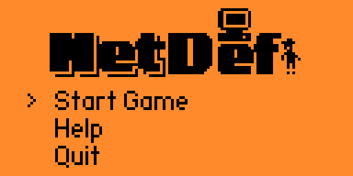
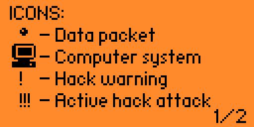
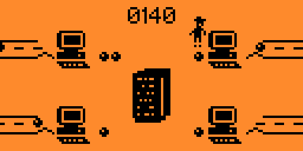
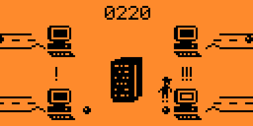

# Network Defender

A cybersecurity-themed game for the Flipper Zero where you defend computer networks from attacks.

## Game Overview

You play as a network administrator protecting four computer systems from cyber attacks. Your goal is to prevent systems from being hacked and keep packet levels below the critical threshold.

## Gameplay Mechanics

- **Movement**: Use the D-pad to move between the four computer systems
- **Accept Packets**: Press OK button to accept packets at your current position
- **Patching**: Hold OK for 3 seconds to patch a system with a warning or active hack
- **DDOS Protection**: Each computer can handle at most 4 packets before being overloaded
- **Global Packet Limit**: The total network can only handle 10 packets across all systems

## Game Elements

### Icons and Visual Indicators

-  - Data packet that needs to be processed
-  - Healthy computer system
-  - Computer flashing between normal and active states indicates a hack warning
-  - Computer with active hack in progress
-  - Fully compromised (dead) computer 
-  - Indicates an active hack in progress
-  - Central server that processes accepted packets
-  - Your character (network admin) that moves between systems

### Game States

1. **Normal Operation**: Systems accept packets which you must regularly clear
2. **Warning State**: A system starts flashing, indicating an imminent hack attempt
3. **Hacking**: A system displays a bug icon, indicating an active hack in progress
4. **Dead System**: A compromised system that can no longer be used

## Game Over Conditions

- **System Hack**: A system hack wasn't patched in time
- **DDOS Attack**: Too many packets accumulated (more than 4 on one system or 10 total)

## Tips

- Stay vigilant for flashing computers - they indicate imminent attacks
- Prioritize patching systems under active hacks
- Keep packet count low on all systems
- Balance your time between packet processing and security patching

## Controls

- **D-Pad**: Move between systems
- **OK Button**: Accept packets (press) or patch systems (hold)
- **Back Button**: Exit game or restart after game over

## Screenshots

## Installation

1. Clone this repository
2. Build with ufbt: `ufbt`
3. Upload to your Flipper Zero: `ufbt launch`

## Credits

Developed by P1X for the Flipper Zero platform.

Enjoy defending your network!