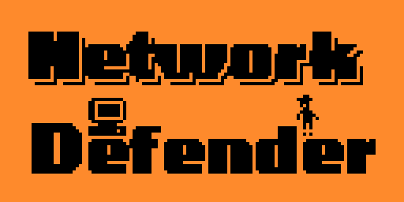

# Network Defender

A Game & Watch style network security game for the Flipper Zero.

## Description

Network Defender is a retro-style game inspired by the classic Nintendo Game & Watch handhelds. You play as a system administrator defending your network from incoming data packets and hacking attempts.

The game features:
- Game & Watch inspired visuals
- Strategic gameplay
- Network traffic management
- Real-time hacking defense
- Score tracking
- Multiple difficulty aspects

## Screenshots

## How to Play

Navigate through four computer systems to manage network traffic and prevent hacking:

- **Move** between computers using the D-pad
- **Press OK** to accept incoming data packets
- **Hold OK** for 3 seconds to patch a computer under attack
- **Prevent DDOS** by keeping total packets below the limit (10)

## Game Elements

- **Computers**: Four systems you need to protect
- **Server**: Central hub that processes accepted packets 
- **Packets**: Data that arrives through network channels
- **Warning "!"**: Indicates an imminent hacking attempt
- **Warning "!!!"**: System is actively being hacked

## Scoring

- +10 points for each accepted packet
- +30 points for successfully patching a hacked system

## Game Over Conditions

The game ends when:
- A system gets fully hacked
- The network suffers a DDOS attack (too many packets)

## Installation

1. Clone this repository
2. Build with ufbt: `ufbt`
3. Upload to your Flipper Zero: `ufbt launch`

## Credits

Developed by P1X for the Flipper Zero platform.

Enjoy defending your network!